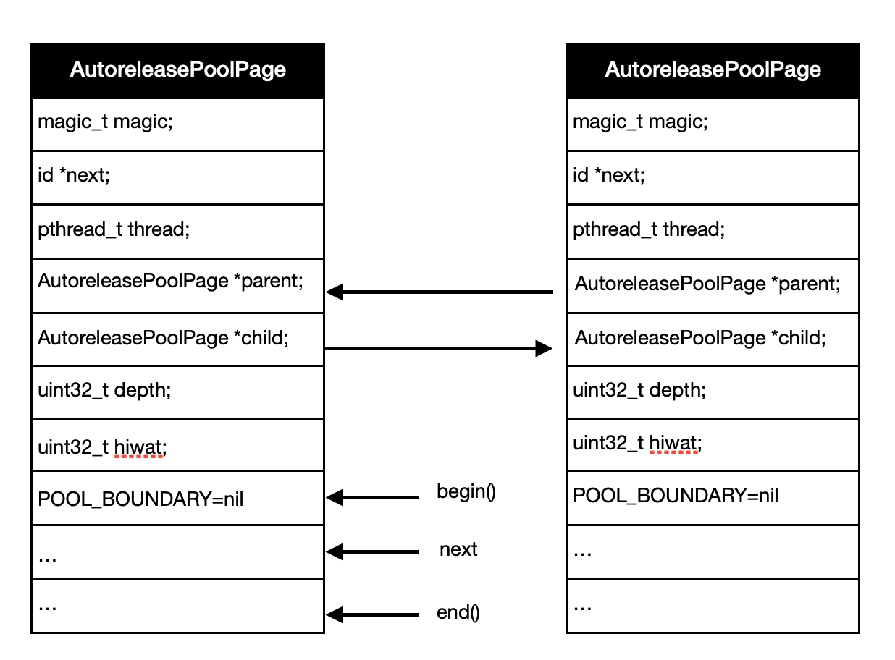

# AutoreleasePool

AutoreleasePool是一个双向链表，主要作用：接受所有autorelease修饰的对象，并在自身生命周期结束之前对所有的对象调用release。

AutoreleasePool使用：

```objective-c
//MRC
NSAutoreleasePool *pool = [[NSAutoreleasePool alloc] init];
id obj = [[NSObject alloc] init];
[obj autorelease];
[pool drain];

//ARC
@autoreleasepool{
    id __autoreleasing objc = [[NSObject alloc] init];
}
```

通过clang命令编译成c++代码：（ARC环境下代码）

```objective-c
clang -rewrite-objc main.mm
```

编译结果：

```objectivec
 /* @autoreleasepool */ { __AtAutoreleasePool __autoreleasepool; 
        id objc = ((NSObject *(*)(id, SEL))(void *)objc_msgSend)((id)((NSObject *(*)(id, SEL))(void *)objc_msgSend)((id)objc_getClass("NSObject"), sel_registerName("alloc")), sel_registerName("init"));
 }

 //结构体__AtAutoreleasePool
 struct __AtAutoreleasePool {
  __AtAutoreleasePool() {atautoreleasepoolobj = objc_autoreleasePoolPush();}
  ~__AtAutoreleasePool() {objc_autoreleasePoolPop(atautoreleasepoolobj);}
  void * atautoreleasepoolobj;
};

 //所以
  /* @autoreleasepool */ {
     void * atautoreleasepoolobj = objc_autoreleasePoolPush();
     ...
     objc_autoreleasePoolPop(atautoreleasepoolobj);
 }
```

从上面的C++源代码可知，@autoreleasePool实际上调用的是objc_autoreleasePoolPush和objc_autoreleasePoolPop方法。先在objc（objc4-818.2）源码入手，找到这两个方法，看一下autoreleasePool的结构是什么。

```objectivec
/***********************************************************************
   Autorelease pool implementation

   A thread's autorelease pool is a stack of pointers. 
   Each pointer is either an object to release, or POOL_BOUNDARY which is 
     an autorelease pool boundary.
   A pool token is a pointer to the POOL_BOUNDARY for that pool. When 
     the pool is popped, every object hotter than the sentinel is released.
   The stack is divided into a doubly-linked list of pages. Pages are added 
     and deleted as necessary. 
   Thread-local storage points to the hot page, where newly autoreleased 
     objects are stored. 
**********************************************************************/
//从源码的注释可以知道autoreleasePool是一个双向链表，每一个page包含对象指针和POOL_BOUNDARY等
//数据，token指向POOL_BOUNDARY，每次autoreleasePool释放时，会从当前地址到token
//之前的所有对象执行release。当前最新的page是hotpage。
class AutoreleasePoolPage : private AutoreleasePoolPageData
{
    static size_t const SIZE = PAGE_MIN_SIZE; //1<<12 = 4096 
    ...
}

struct AutoreleasePoolPageData
{
    magic_t const magic; //用来校验结构的完整性
    __unsafe_unretained id *next;  //指向下一个对象的添加地址，初始化时指向begin()
    pthread_t const thread;  //当前线程
    AutoreleasePoolPage * const parent; //上一个page，第一个page的值为nil
    AutoreleasePoolPage *child; //下一个page，最后一个page的值为nil
    uint32_t const depth;  //page的深度，从0开始，往后递增
    uint32_t hiwat; //表示最大入栈对象数
}
```

autoreleasePool并不是特定的结构，而是由autoreleasePoolPage连接起来的双链表，所以，结构为：



#### 1.objc_autoreleasePoolPush

调用objc_autoreleasePoolPush，最终会走到autoreleaseFast方法：

1.有hotPage并且没有存满，则直接将POOL_BOUNDARY加进去作为第一个对象，然后next++。

2.有hotPage但是存满了，则迭代寻找一个没有满的childPage，找到了则设置当前的childPage为hotPage并且将POOL_BOUNDARY加进去作为第一个对象，然后next++；如果没有找到，则新建一个childPage设置为hotPage并且将POOL_BOUNDARY加进去作为第一个对象，然后next++。

3.没有hotPage就新建一个autoreleasePoolPage，并且将POOL_BOUNDARY传进入作为第一个对象，就是哨兵对象，后面讲autoreleasePool释放时会说到，然后设置当前的page为hotPage，next++。

```objectivec
static inline void *push() 
{
    id *dest;
    if (slowpath(DebugPoolAllocation)) { //Debug模式
       // Each autorelease pool starts on a new pool page.
       dest = autoreleaseNewPage(POOL_BOUNDARY);
    } else {
        dest = autoreleaseFast(POOL_BOUNDARY);
    }
    //EMPTY_POOL_PLACEHOLDER为占位pool，不分配内存
    //push的第一个对象为POOL_BOUNDARY
    ASSERT(dest == EMPTY_POOL_PLACEHOLDER || *dest == POOL_BOUNDARY);
    return dest;
}

static inline id *autoreleaseFast(id obj)
{
    AutoreleasePoolPage *page = hotPage();
    if (page && !page->full()) {
        return page->add(obj);
    } else if (page) {
        return autoreleaseFullPage(obj, page);
    } else {
        return autoreleaseNoPage(obj);
    }
}

static inline void setHotPage(AutoreleasePoolPage *page)
{
    if (page) page->fastcheck(); //校验page的完整性
    tls_set_direct(key, (void *)page); //将page存在TLS里                            
}

static inline AutoreleasePoolPage *hotPage()
{
    AutoreleasePoolPage *result = (AutoreleasePoolPage *)
    tls_get_direct(key);  //取出存在Thread Loacl Storage的autoreleasePage
    if ((id *)result == EMPTY_POOL_PLACEHOLDER) return nil;
    if (result) result->fastcheck(); //校验page的完整性
    return result;
}

bool full() {
    return next == end();  //当next=end，page存满了
}

static __attribute__((noinline))
id *autoreleaseFullPage(id obj, AutoreleasePoolPage *page)
{
    // The hot page is full.
    // Step to the next non-full page, adding a new page if necessary.
    // Then add the object to that page.
    ASSERT(page == hotPage());
    ASSERT(page->full()  ||  DebugPoolAllocation);

    do {
        if (page->child) page = page->child; //获取还没有满的page
        else page = new AutoreleasePoolPage(page); //如果没有则创建新的，当前page为parent
    } while (page->full());

    setHotPage(page); //将当前的page设置为hotPage
    return page->add(obj); //将obj添加到page里
}

id *add(id obj)
{
    ASSERT(!full());
    unprotect(); //打开保护，类似于开锁，autoreleasePool的内存为读写
    id *ret;
    ret = next;  // faster than `return next-1` because of aliasing
    *next++ = obj;  //next = obj; next++;
    protect();  //保护，类似于上锁，autoreleasePool的内存为只读
    return ret;
}

inline void protect() {
#if PROTECT_AUTORELEASEPOOL
    mprotect(this, SIZE, PROT_READ);  //readOnly
    check();
#endif
}

inline void unprotect() {
#if PROTECT_AUTORELEASEPOOL
    check();
    mprotect(this, SIZE, PROT_READ | PROT_WRITE);  //read and write
#endif
}
```

#### 2.autorelease

对象调用autorelease，其实就是调用autoreleaseFast方法：

```objectivec
static inline id autorelease(id obj)
{
   id *dest __unused = autoreleaseFast(obj);
   return obj;
}
```

autorelease方法和objc_autoreleasePoolPush方法区别在于，前者可以是POOL_BOUNDARY或者对象，后者一定是POOL_BOUNDARY。当有多个autoreleasePool叠加时，它们的分界在于POOL_BOUNDARY，除了最后一个autoreleasePool，两个POOL_BOUNDARY之间就是一个autoreleasePool的所有对象。

#### 3.objc_autoreleasePoolPop

autoreleasePool销毁时，调用的是pop方法：

```objectivec
static inline void
pop(void *token)  //token = &POOL_BOUNDARY
{
    //省去无关代码
    AutoreleasePoolPage *page = pageForPointer(token);  //根据token获得所在
    id *stop = (id *)token;
    return popPage<false>(token, page, stop);
}

static AutoreleasePoolPage *pageForPointer(const void *p)
{
    return pageForPointer((uintptr_t)p); //将指针转换成uintptr_t
}

static AutoreleasePoolPage *pageForPointer(uintptr_t p)
{
    AutoreleasePoolPage *result;
    uintptr_t offset = p % SIZE; //获得page首地址的偏移

    ASSERT(offset >= sizeof(AutoreleasePoolPage));

    result = (AutoreleasePoolPage *)(p - offset); //page首地址
    result->fastcheck();  //完整性校验

    return result;
}

//主要函数
template<bool allowDebug>
static void
popPage(void *token, AutoreleasePoolPage *page, id *stop)
{
    if (allowDebug && PrintPoolHiwat) printHiwat();

    page->releaseUntil(stop); //从hotPage释放到stop结束

    // memory: delete empty children
    //因为从hotPage一直释放到stop(POOL_BOUNDARY)，也就是除了hotPage，后面的childPage都是为空
    if (page->child) {
        // hysteresis: keep one empty child if page is more than half full
        if (page->lessThanHalfFull()) { //如果page的对象少于过一半，则保留一个空页面
            page->child->kill(); //child->kill()是把child后面的页面释放调
        }
        else if (page->child->child) { //如果page的对象超过一半，则保留两个空页面
            page->child->child->kill();
        }
    }
}

//释放对象到stop结束
void releaseUntil(id *stop)
{
    // Not recursive: we don't want to blow out the stack
    // if a thread accumulates a stupendous amount of garbage
    //不使用递归：我们不想因为线程不断积累的垃圾而使栈所占内存爆炸

    while (this->next != stop) {
        // Restart from hotPage() every time, in case -release
        // autoreleased more objects
        AutoreleasePoolPage *page = hotPage();  //从hotPage开始释放

        // fixme I think this `while` can be `if`, but I can't prove it
        while (page->empty()) {  //当前的hotPage的对象被释放完了，重新设置hotPage
            page = page->parent;
            setHotPage(page);
        }

        page->unprotect();
        id obj = *--page->next; //page->next = page->next - 1; obj = *page->next
        memset((void*)page->next, SCRIBBLE, sizeof(*page->next)); //SCRIBBLE = 0xA3被释放的对象的位置填充0xA3
        page->protect();

        if (obj != POOL_BOUNDARY) {
            objc_release(obj); //释放对象
        }
    }

    setHotPage(this); //重设hotPage
}

//将当前page后面的页面释放掉
void kill()
{
    // Not recursive: we don't want to blow out the stack
    // if a thread accumulates a stupendous amount of garbage
    AutoreleasePoolPage *page = this;
    while (page->child) page = page->child;

    AutoreleasePoolPage *deathptr;
    do {
        deathptr = page;
        page = page->parent;
        if (page) {
            page->unprotect();
            page->child = nil;
            page->protect();
        }
        delete deathptr;
    } while (deathptr != this);
}
```

1.通过POOL_BOUNDARY找到当前page所在地址。

2.从hotPage到当前page的POOL_BOUNDARY，之间的所有对象释放掉。

3.如果当前page剩余对象少于一半，则保留一个空白页，否则保留两个空白页。

总结：讲到这里，把整个autoreleasePool的结构和执行过程都讲解了一遍。简单来讲，所有添加进autoreleasePool的对象，会在autoreleasePool销毁时，执行一次release操作，因此可以延时对象的释放。但是autoreleasePool不会自动对对象执行一次retain，只会在autoreleasePool被销毁时对所有对象执行一次release操作。autoreleasePool在什么时候被销毁？自建的autoreleasePool在超出作用域时就会被销毁，而runloop关联的autoreleasePool会在runloop迭代结束时销毁。

#### 4.objc_autoreleaseReturnValue和objc_retainAutoreleasedReturnValue

对于alloc/new/copy/mutableCopy开头的函数返回的对象需要调用者在使用完释放，对于其他方法则不需要调用者释放，而是放进autoreleasePool里面，由autoreleasePool统一释放。进入ARC时代，编译器对返回值做了一些优化。

```objectivec
@DemoClass
+ (id)makeObject {
    return [[DemoClass alloc] init];
}

id objc = [DemoClass makeObject];
```

通过clang编译命令编译成llvm中间码：

```c
clang -S -fobjc-arc -emit-llvm main.mm -o main.ll
```

得到编译后的代码：

```objectivec
@DemoClass
+ (id)makeObject {
   id objc = objc_msgSend(objc_msgSend(DemoClass, @selector(alloc)), @selector(init));
   objc_autoreleaseReturnValue(objc);
   return objc;
}

id __strong objc = objc_msgSend(DemoClass, @selector(makeObject));
objc_retainAutoreleasedReturnValue(objc);
objc_release(objc);
```

objc_autoreleaseReturnValue会判断调用者是否接下来会调用objc_retainAutoreleasedReturnValue。如果会调用，则直接返回objc；如果不会调用，则将objc添加进autoreleasePool返回。

objc_autoreleaseReturnValue的实现：

```objectivec
// Prepare a value at +1 for return through a +0 autoreleasing convention.
id 
objc_autoreleaseReturnValue(id obj)
{
    if (prepareOptimizedReturn(ReturnAtPlus1)) return obj;

    return objc_autorelease(obj);
}

// Try to prepare for optimized return with the given disposition (+0 or +1).
// Returns true if the optimized path is successful.
// Otherwise the return value must be retained and/or autoreleased as usual.
static ALWAYS_INLINE bool 
prepareOptimizedReturn(ReturnDisposition disposition)
{
    ASSERT(getReturnDisposition() == ReturnAtPlus0);

    //判断调用者是否接下来调用objc_retainAutoreleasedReturnValue或者objc_unsafeClaimAutoreleasedReturnValue
    //方法，如果是，则设置优化标志，并返回true；如果不是，则返回false。
    if (callerAcceptsOptimizedReturn(__builtin_return_address(0))) { 
        //通过TLS储存是否优化的标志 
        if (disposition) setReturnDisposition(disposition);
        return true;
    }

    return false;
}

//通过tls存储优化标志
static ALWAYS_INLINE ReturnDisposition 
getReturnDisposition()
{
    return (ReturnDisposition)(uintptr_t)tls_get_direct(RETURN_DISPOSITION_KEY);
}


static ALWAYS_INLINE void 
setReturnDisposition(ReturnDisposition disposition)
{
    tls_set_direct(RETURN_DISPOSITION_KEY, (void*)(uintptr_t)disposition);
}
```

1.判断调用者是否会调用objc_retainAutoreleasedReturnValue或者objc_unsafeClaimAutoreleasedReturnValue，如果是，则需要优化并把标志存储在tls里面，并返回true；如果不是，则直接返回false。

2.如果优化，则直接返回对象；如果不优化，则将对象添加入autoreleasePool。

objc_retainAutoreleasedReturnValue的实现：

```objectivec
// Accept a value returned through a +0 autoreleasing convention for use at +1.
id
objc_retainAutoreleasedReturnValue(id obj)
{
    if (acceptOptimizedReturn() == ReturnAtPlus1) return obj; //判断是否优化

    return objc_retain(obj);
}

// Try to accept an optimized return.
// Returns the disposition of the returned object (+0 or +1).
// An un-optimized return is +0.
static ALWAYS_INLINE ReturnDisposition 
acceptOptimizedReturn()
{
    ReturnDisposition disposition = getReturnDisposition(); //取出tls存储的优化标志
    setReturnDisposition(ReturnAtPlus0);  // reset to the unoptimized state
    return disposition;
}
```

1.取出tls储存的标志，判断是否优化。如果是，则直接返回对象；如果不是，则 retain对象。

优化前和优化后的代码对比：

```objectivec
@DemoClass

//优化前
id __strong objc = objc_msgSend(objc_msgSend(DemoClass, @selector(alloc)), @selector(init));
objc_autorelease(objc);
objc_retain(objc);
objc_release(objc);

//优化后
id __strong objc = objc_msgSend(objc_msgSend(DemoClass, @selector(alloc)), @selector(init));
objc_release(objc);
```

优化后省去了一次retain和release，并且没有用到autoreleasePool。

#### 5.在ARC下iOS为什么还需要autoreleasePool？什么时候需要自己创建autoreleasePool?

（1）在ARC下iOS为什么还需要autoreleasePool？

首先ARC和autoreleasePool并不冲突，不是同一个概念。ARC只是编译器在编译期间帮忙插入retain/release/autorelease等函数，而autoreleasePool只是在适当时机将添加进去的对象执行release函数而已。至于为什么需要autoreleasePool？有几个原因：1.防止内存泄漏。如果没有autoreleasePool，线程里执行autorelease的对象就得不到释放，导致内存泄漏。至于为什么会有调用autorelease的对象，一部分是MRC遗留的问题，比如：非alloc/new/copy/mutableCopy开头的函数，在MRC时期都是加入autoreleasePool，虽然，有部分在ARC优化下（具体看4），没有加入autoreleasePool，但是还有遗留的，所以需要autoreleasePool；还有就是，一些实例想持有对象但是不想释放的，也要用到autoreleasePool。（注意：GC不需要autoreleasePool，因为内存管理机制不一样。）

（2）什么时候需要自己创建autoreleasePool?

1.在线程没有autoreleasePool，避免内存泄漏需要自己创建，比如：编写不基于UI 框架的程序，比如命令行工具；生成辅助线程。

2.避免内存峰值。比如：在循环里创建了很多临时对象，并且这些对象都会加入autoreleasePool。因为，这些临时对象都是加入离自己最近的autoreleasePool，比如主线程的autoreleasePool，而主线程的autoreleasePool只有在主线程Runloop进入休眠前和退出的时候才会释放autoreleasePool里面的对象，其他时候，这些临时的对象会一直占用内存，所以，需要在循环内部创建自己的autoreleasePool，生成的临时对象就会加入自己创建的autoreleasePool里面，而该autoreleasePool会在下一个循环开始前被释放掉，连同临时对象也会被释放，不会造成内存峰值。（注意：如果临时对象超出循环就被释放，换句话说不会加入autoreleasePool的临时对象，那么就不需要自己创建一个autoreleasePool包裹。）

### 6.总结

AutoreleasePool只有一个功能，就是延时对象的释放，也就是说，一个对象想要超过自己的作用域而不被释放只能使用AutoreleasePool。一般情况下不需要自己创建AutoreleasePool，主线程会有自己的AutoreleasePool，只有在某些情况下需要创建自己的AutoreleasePool，比如：辅助线程。

------

#### 参考：

[objc4-818.2](https://opensource.apple.com/tarballs/objc4/)

[自动释放池的前世今生](https://github.com/Draveness/analyze/tree/master/contents/objc)

[黑幕背后的Autorelease · sunnyxx的技术博客](http://blog.sunnyxx.com/2014/10/15/behind-autorelease/)

