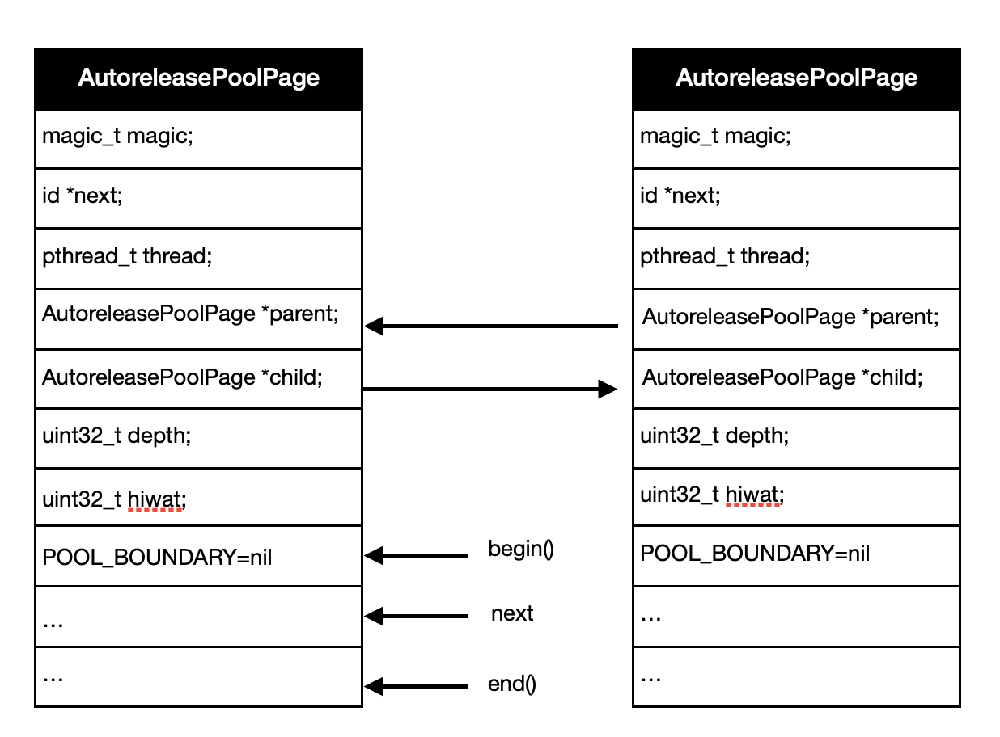

# ARC

移动端比较流行内存回收机制有两种，一种是GC(GarbageCollection)，另外一种就是RC(ReferenceCounting)。Android使用的是GC内存回收机制，iOS使用的是RC内存回收机制。RC相比于GC的优点在于，对象的内存回收平缓进行，不会造成界面卡顿，缺点在于会引起循环引用，造成内存泄漏。在iOS5后，苹果提出了ARC(AutoReferenceCounting)技术，自动引用计数管理，将内存的管理交给编译器，这样做不仅降低了程序崩溃，内存泄漏等风险的同时，很大程度减少了程序员的开发量。

### 1.内存管理方式

在理解ARC之前，我们先看iOS对于对象的内存是如何管理的：

| 对象操作    | Objective-C方法              |
| ------- | -------------------------- |
| 生成并持有对象 | alloc/new/copy/mutableCopy |
| 持有对象    | retain                     |
| 释放对象    | release                    |
| 自动释放    | autorelease                |
| 废弃对象    | dealloc                    |

自己生成的对象自己持有：

苹果规定以alloc/new/copy/mutableCopy开头的方法生成返回的对象自己持有，也就是引用计数为1。

```objectivec
id objc = [[NSObject alloc] init]; //rc = 1
```

非自己生成的对象，自己也能持有：

不是以alloc/new/copy/mutableCopy开头的方法返回的对象，想要持有需要retain。

```objectivec
id objc = [NSMutableArray array];
[objc retain];
```

不需要再持有对象，释放对象：

不需要再持有对象时，要及时释放对象，避免造成内存泄漏。

```objectivec
id objc = [[NSObject alloc] init];
...
[objc release];
```

不能释放非自己持有的对象：

因为不是自己持有的对象，该对象的引用计数不会发生改变，如果去释放该对象，就会造成对象重复释放，从而引起崩溃。

```objectivec
id objc = [NSMutableArray array];
//[objc release];  不需要释放
```

不想持有对象，但是却想使用对象，可以通过autorelease:

一般来说，如果想要使用对象就必需强引用对象，不然，如果对象引用计数为0，那么使用就会造成崩溃，最后在使用完后还要记得释放对象。如果只是想要使用对象，而不想释放对象，就需要通过autorelease来实现。将对象放入autoreleasePool，然后在autoreleasePool销毁时，执行一次release，这样就可以使用对象而不用管理它的生命周期。

```objectivec
id objc = [NSMutableArray array];
[objc retain]; //放入autoreleasePool之前需要retain一次
[objc autorelease]; //将对象放入autoreleasePool
```

### 2.alloc/retain/release/dealloc的实现

Object-C的内存管理都是以alloc/retain/release/dealloc等方法为基础的，其中alloc方法的调用会新建一个对象，retain则会增加对象的引用计数，release则会使对象的引用计数减一，直到对象的引用计数为零，则会调用dealloc函数，接下来一一讲解这几个方法的实现，进一步加深内存管理的理解。（基于objc4-818.2）

#### 2.1alloc

alloc最终会走到callAlloc方法：

```objectivec
// Calls [cls alloc].
id
objc_alloc(Class cls)
{
    return callAlloc(cls, true/*checkNil*/, false/*allocWithZone*/);
}

+ (id)alloc {
    return _objc_rootAlloc(self);
}

// Base class implementation of +alloc. cls is not nil.
// Calls [cls allocWithZone:nil].
id
_objc_rootAlloc(Class cls)
{
    return callAlloc(cls, false/*checkNil*/, true/*allocWithZone*/);
}

static ALWAYS_INLINE id
callAlloc(Class cls, bool checkNil, bool allocWithZone=false)
{
#if __OBJC2__
    if (slowpath(checkNil && !cls)) return nil;
    if (fastpath(!cls->ISA()->hasCustomAWZ())) {
        return _objc_rootAllocWithZone(cls, nil);  //分配内存空间
    }
#endif

    // No shortcuts available.
    if (allocWithZone) {
        return ((id(*)(id, SEL, struct _NSZone *))objc_msgSend)(cls, @selector(allocWithZone:), nil);
    }
    return ((id(*)(id, SEL))objc_msgSend)(cls, @selector(alloc));
}

NEVER_INLINE
id
_objc_rootAllocWithZone(Class cls, malloc_zone_t *zone __unused)
{
    // allocWithZone under __OBJC2__ ignores the zone parameter
    return _class_createInstanceFromZone(cls, 0, nil,
                                         OBJECT_CONSTRUCT_CALL_BADALLOC);
}

/***********************************************************************
* class_createInstance
* fixme
* Locking: none
*
* Note: this function has been carefully written so that the fastpath
* takes no branch.
**********************************************************************/
static ALWAYS_INLINE id
_class_createInstanceFromZone(Class cls, size_t extraBytes, void *zone,
                              int construct_flags = OBJECT_CONSTRUCT_NONE,
                              bool cxxConstruct = true,
                              size_t *outAllocatedSize = nil)
{
    ASSERT(cls->isRealized());

    // Read class's info bits all at once for performance
    bool hasCxxCtor = cxxConstruct && cls->hasCxxCtor();
    bool hasCxxDtor = cls->hasCxxDtor();
    bool fast = cls->canAllocNonpointer();
    size_t size;

    size = cls->instanceSize(extraBytes);  //>=16
    if (outAllocatedSize) *outAllocatedSize = size;

    id obj;
    if (zone) {
        obj = (id)malloc_zone_calloc((malloc_zone_t *)zone, 1, size);
    } else {
        obj = (id)calloc(1, size); //分配size大小的内存空间
    }
    if (slowpath(!obj)) {
        if (construct_flags & OBJECT_CONSTRUCT_CALL_BADALLOC) {
            return _objc_callBadAllocHandler(cls);
        }
        return nil;
    }

    if (!zone && fast) {
        obj->initInstanceIsa(cls, hasCxxDtor); //初始化isa
    } else {
        // Use raw pointer isa on the assumption that they might be
        // doing something weird with the zone or RR.
        obj->initIsa(cls);
    }

    if (fastpath(!hasCxxCtor)) {
        return obj;
    }

    construct_flags |= OBJECT_CONSTRUCT_FREE_ONFAILURE;
    return object_cxxConstructFromClass(obj, cls, construct_flags);
}

inline void 
objc_object::initIsa(Class cls, bool nonpointer, UNUSED_WITHOUT_INDEXED_ISA_AND_DTOR_BIT bool hasCxxDtor)
{ 
    ASSERT(!isTaggedPointer()); 

    isa_t newisa(0);

    if (!nonpointer) {
        newisa.setClass(cls, this);
    } else {
        ASSERT(!DisableNonpointerIsa);
        ASSERT(!cls->instancesRequireRawIsa());


#if SUPPORT_INDEXED_ISA
        ASSERT(cls->classArrayIndex() > 0);
        newisa.bits = ISA_INDEX_MAGIC_VALUE;
        // isa.magic is part of ISA_MAGIC_VALUE
        // isa.nonpointer is part of ISA_MAGIC_VALUE
        newisa.has_cxx_dtor = hasCxxDtor;
        newisa.indexcls = (uintptr_t)cls->classArrayIndex();
#else
        newisa.bits = ISA_MAGIC_VALUE;
        // isa.magic is part of ISA_MAGIC_VALUE
        // isa.nonpointer is part of ISA_MAGIC_VALUE
#   if ISA_HAS_CXX_DTOR_BIT
        newisa.has_cxx_dtor = hasCxxDtor;
#   endif
        newisa.setClass(cls, this);
#endif
        newisa.extra_rc = 1; //初始化rc=1
    }

    // This write must be performed in a single store in some cases
    // (for example when realizing a class because other threads
    // may simultaneously try to use the class).
    // fixme use atomics here to guarantee single-store and to
    // guarantee memory order w.r.t. the class index table
    // ...but not too atomic because we don't want to hurt instantiation
    isa = newisa;
}
```

alloc先计算class所需的内存空间，然后分配给class的实例，最后初始化isa，并将rc赋值为1，返回实例对象的内存地址。

#### 2.2retain

调用retain最终会走到rootRetain方法：

```objectivec
ALWAYS_INLINE id
objc_object::rootRetain(bool tryRetain, objc_object::RRVariant variant)
{
    if (slowpath(isTaggedPointer())) return (id)this; //如果是TaggerPointer直接返回

    bool sideTableLocked = false;
    bool transcribeToSideTable = false;

    isa_t oldisa;
    isa_t newisa;

    oldisa = LoadExclusive(&isa.bits);  //获取isa,bits

    if (variant == RRVariant::FastOrMsgSend) {  
        // These checks are only meaningful for objc_retain()
        // They are here so that we avoid a re-load of the isa.
        if (slowpath(oldisa.getDecodedClass(false)->hasCustomRR())) {  //判断是否有自定义的方法
            ClearExclusive(&isa.bits); //清除isa,bits信息
            if (oldisa.getDecodedClass(false)->canCallSwiftRR()) { //Swift调这个
                return swiftRetain.load(memory_order_relaxed)((id)this);
            }
            return ((id(*)(objc_object *, SEL))objc_msgSend)(this, @selector(retain)); //其他通过消息转发调用自定义方法
        }
    }

    if (slowpath(!oldisa.nonpointer)) {  //不是nonpointer并且是metaClass直接返回
        // a Class is a Class forever, so we can perform this check once
        // outside of the CAS loop
        if (oldisa.getDecodedClass(false)->isMetaClass()) {
            ClearExclusive(&isa.bits);
            return (id)this;
        }
    }

    do {
        transcribeToSideTable = false;
        newisa = oldisa;
        if (slowpath(!newisa.nonpointer)) {
            ClearExclusive(&isa.bits);
            if (tryRetain) return sidetable_tryRetain() ? (id)this : nil; //从retain方法过来，tryRetain=false
            else return sidetable_retain(sideTableLocked);  //不是nonpointer调用sidetable_retain
        }
        // don't check newisa.fast_rr; we already called any RR overrides
        if (slowpath(newisa.isDeallocating())) { //对象是否正在释放，如果是则直接返回
            ClearExclusive(&isa.bits);
            if (sideTableLocked) {
                ASSERT(variant == RRVariant::Full);
                sidetable_unlock();
            }
            if (slowpath(tryRetain)) {
                return nil;
            } else {
                return (id)this;
            }
        }
        uintptr_t carry; //carry用来判断extra_rc是否有溢出
        newisa.bits = addc(newisa.bits, RC_ONE, 0, &carry);  // extra_rc++

        if (slowpath(carry)) {
            // newisa.extra_rc++ overflowed
            if (variant != RRVariant::Full) {
                ClearExclusive(&isa.bits);
                return rootRetain_overflow(tryRetain);
            }
            // Leave half of the retain counts inline and 
            // prepare to copy the other half to the side table.
            if (!tryRetain && !sideTableLocked) sidetable_lock();
            sideTableLocked = true;
            transcribeToSideTable = true;
            newisa.extra_rc = RC_HALF;
            newisa.has_sidetable_rc = true;
        }
    } while (slowpath(!StoreExclusive(&isa.bits, &oldisa.bits, newisa.bits)));  
    //调用__c11_atomic_compare_exchange_weak(&isa.bits, &oldisa.bits, newisa.bits)
    //原子操作，防止多线程修改isa,bits的值，导致isa,bits和oldisa,bits不一致
    //如果isa.bits = oldisa,bits，则交换newisa.bits和isa.bits，isa.bits和oldisa.bits的值，并返回true
    //如果isa.bits != oldisa,bits，则交换isa.bits和oldisa.bits，并返回false，然后重新retain


    if (variant == RRVariant::Full) {
        if (slowpath(transcribeToSideTable)) {
            // Copy the other half of the retain counts to the side table.
            sidetable_addExtraRC_nolock(RC_HALF);
        }

        if (slowpath(!tryRetain && sideTableLocked)) sidetable_unlock();
    } else {
        ASSERT(!transcribeToSideTable);
        ASSERT(!sideTableLocked);
    }

    return (id)this;
}

id
objc_object::sidetable_retain(bool locked)
{
#if SUPPORT_NONPOINTER_ISA
    ASSERT(!isa.nonpointer);
#endif
    SideTable& table = SideTables()[this];

    if (!locked) table.lock();
    size_t& refcntStorage = table.refcnts[this]; //获取当前对象引用计数的地址
    if (! (refcntStorage & SIDE_TABLE_RC_PINNED)) { //判断是否溢出
        refcntStorage += SIDE_TABLE_RC_ONE; //从2～63位，储存的是对象的引用计数，SIDE_TABLE_RC_ONE=0x100
    }
    table.unlock();

    return (id)this;
}

// Move some retain counts to the side table from the isa field.
// Returns true if the object is now pinned.
bool 
objc_object::sidetable_addExtraRC_nolock(size_t delta_rc)
{
    ASSERT(isa.nonpointer);
    SideTable& table = SideTables()[this];

    size_t& refcntStorage = table.refcnts[this];
    size_t oldRefcnt = refcntStorage;
    // isa-side bits should not be set here
    ASSERT((oldRefcnt & SIDE_TABLE_DEALLOCATING) == 0);
    ASSERT((oldRefcnt & SIDE_TABLE_WEAKLY_REFERENCED) == 0);

    if (oldRefcnt & SIDE_TABLE_RC_PINNED) return true; //是否溢出

    uintptr_t carry;
    size_t newRefcnt = 
        addc(oldRefcnt, delta_rc << SIDE_TABLE_RC_SHIFT, 0, &carry);
    if (carry) { //判断是否溢出
        refcntStorage =
            SIDE_TABLE_RC_PINNED | (oldRefcnt & SIDE_TABLE_FLAG_MASK);
        return true;
    }
    else {
        refcntStorage = newRefcnt;
        return false;
    }
}
```

1.判断是否为TaggedPointer，如果是，则直接返回，如果不是，往下走。

2.判断是否有自定义方法，如果有，则判断是否为Swift，如果是，则直接调用SwiftRetain，如果不是，则走消息转发，调用自定义方法。没有自定义方法，继续往下走。

3.如果不是nonpointer并且是metaClass，则直接返回，否则往下走。

4.这里开始进入do-while循环，如果不是nonpointer，走sidetable_retain；如果是，则继续往下走。

5.如果对象正在释放，直接返回，否则往下走。

6.isa.bits.extra_rc++，如果isa.bits的引用计数溢出，则isa.bits.extra_rc引用计数减一半，并将另一半引用计数放到SideTable上，往下走；如果没有溢出，往下走。

7.判断前后的isa.bits是否一致，不一致，回到第4步，一致则跳出循环，往下走。

8.返回对象。

#### 2.3release

调用release方法最终会走到rootRelease：

```objectivec
//Return true if the object should now be deallocated.
ALWAYS_INLINE bool
objc_object::rootRelease(bool performDealloc, objc_object::RRVariant variant)
{
    if (slowpath(isTaggedPointer())) return false; //如果是TaggedPointer直接返回

    bool sideTableLocked = false;

    isa_t newisa, oldisa;

    oldisa = LoadExclusive(&isa.bits); //获取isa.bits

    if (variant == RRVariant::FastOrMsgSend) {
        // These checks are only meaningful for objc_release()
        // They are here so that we avoid a re-load of the isa.
        if (slowpath(oldisa.getDecodedClass(false)->hasCustomRR())) {  //如果有自定义方法，则调用自定义方法
            ClearExclusive(&isa.bits); //清除isa.bits
            if (oldisa.getDecodedClass(false)->canCallSwiftRR()) {
                swiftRelease.load(memory_order_relaxed)((id)this);
                return true;
            }
            ((void(*)(objc_object *, SEL))objc_msgSend)(this, @selector(release)); //调用自定义方法通过消息转发
            return true;
        }
    }

    if (slowpath(!oldisa.nonpointer)) {
        // a Class is a Class forever, so we can perform this check once
        // outside of the CAS loop
        if (oldisa.getDecodedClass(false)->isMetaClass()) { //如果是元类，直接返回
            ClearExclusive(&isa.bits);
            return false;
        }
    }

retry:
    do {
        newisa = oldisa;
        if (slowpath(!newisa.nonpointer)) {
            ClearExclusive(&isa.bits);
            return sidetable_release(sideTableLocked, performDealloc); //不是nonpointer直接调用sidetable_release
        }
        if (slowpath(newisa.isDeallocating())) { //对象正在释放，return false
            ClearExclusive(&isa.bits);
            if (sideTableLocked) {
                ASSERT(variant == RRVariant::Full);
                sidetable_unlock();
            }
            return false;
        }

        // don't check newisa.fast_rr; we already called any RR overrides
        uintptr_t carry;
        newisa.bits = subc(newisa.bits, RC_ONE, 0, &carry);  // extra_rc--
        if (slowpath(carry)) { //extra_rc不够减，需要向sidetable借
            // don't ClearExclusive()
            goto underflow;
        }
    } while (slowpath(!StoreReleaseExclusive(&isa.bits, &oldisa.bits, newisa.bits)));
    //将newisa,bits替换isa,bits，将isa.bits替换oldisa,bits

    if (slowpath(newisa.isDeallocating())) //正在释放，走释放时的函数
        goto deallocate;

    if (variant == RRVariant::Full) {
        if (slowpath(sideTableLocked)) sidetable_unlock();
    } else {
        ASSERT(!sideTableLocked);
    }
    return false;

 underflow:
    // newisa.extra_rc-- underflowed: borrow from side table or deallocate

    // abandon newisa to undo the decrement
    newisa = oldisa;

    if (slowpath(newisa.has_sidetable_rc)) { //是否有sideTable存储rc
        if (variant != RRVariant::Full) {
            ClearExclusive(&isa.bits);
            return rootRelease_underflow(performDealloc);
        }

        // Transfer retain count from side table to inline storage.

        if (!sideTableLocked) {
            ClearExclusive(&isa.bits);
            sidetable_lock();
            sideTableLocked = true;
            // Need to start over to avoid a race against 
            // the nonpointer -> raw pointer transition.
            oldisa = LoadExclusive(&isa.bits);
            goto retry;
        }

        // Try to remove some retain counts from the side table.        
        auto borrow = sidetable_subExtraRC_nolock(RC_HALF); 

        bool emptySideTable = borrow.remaining == 0; // we'll clear the side table if no refcounts remain there

        if (borrow.borrowed > 0) {
            // Side table retain count decreased.
            // Try to add them to the inline count.
            bool didTransitionToDeallocating = false;
            newisa.extra_rc = borrow.borrowed - 1;  // redo the original decrement too
            newisa.has_sidetable_rc = !emptySideTable;

            bool stored = StoreReleaseExclusive(&isa.bits, &oldisa.bits, newisa.bits);
            //将newisa.bits替换isa,bits，将isa.bits替换oldisa.bits

            if (!stored && oldisa.nonpointer) { //更新失败重试
                // Inline update failed. 
                // Try it again right now. This prevents livelock on LL/SC 
                // architectures where the side table access itself may have 
                // dropped the reservation.
                uintptr_t overflow;
                newisa.bits =
                    addc(oldisa.bits, RC_ONE * (borrow.borrowed-1), 0, &overflow);
                newisa.has_sidetable_rc = !emptySideTable;
                if (!overflow) {
                    stored = StoreReleaseExclusive(&isa.bits, &oldisa.bits, newisa.bits);
                    if (stored) {
                        didTransitionToDeallocating = newisa.isDeallocating();
                    }
                }
            }

            if (!stored) { //更新失败，清空重试
                // Inline update failed.
                // Put the retains back in the side table.
                ClearExclusive(&isa.bits);
                sidetable_addExtraRC_nolock(borrow.borrowed);
                oldisa = LoadExclusive(&isa.bits);
                goto retry;
            }

            // Decrement successful after borrowing from side table.
            if (emptySideTable) //借成功之后，sideTable计数为空
                sidetable_clearExtraRC_nolock();

            if (!didTransitionToDeallocating) {
                if (slowpath(sideTableLocked)) sidetable_unlock();
                return false;
            }
        }
        else {
            // Side table is empty after all. Fall-through to the dealloc path.
        }
    }

deallocate:
    // Really deallocate.

    ASSERT(newisa.isDeallocating());
    ASSERT(isa.isDeallocating());

    if (slowpath(sideTableLocked)) sidetable_unlock();

    __c11_atomic_thread_fence(__ATOMIC_ACQUIRE);

    if (performDealloc) {
        ((void(*)(objc_object *, SEL))objc_msgSend)(this, @selector(dealloc));
    }
    return true;
}

// rdar://20206767
// return uintptr_t instead of bool so that the various raw-isa 
// -release paths all return zero in eax
uintptr_t
objc_object::sidetable_release(bool locked, bool performDealloc)
{
#if SUPPORT_NONPOINTER_ISA
    ASSERT(!isa.nonpointer);
#endif
    SideTable& table = SideTables()[this];

    bool do_dealloc = false;

    if (!locked) table.lock();
    auto it = table.refcnts.try_emplace(this, SIDE_TABLE_DEALLOCATING); //返回的是一个结构体，结构体里有两个变量，一个为first，first->second是引用计数的内存地址，second为是否释放的标志
    auto &refcnt = it.first->second; //引用计数地址
    if (it.second) {
        do_dealloc = true;
    } else if (refcnt < SIDE_TABLE_DEALLOCATING) {  //引用计数为0，标志释放
        // SIDE_TABLE_WEAKLY_REFERENCED may be set. Don't change it.
        do_dealloc = true;
        refcnt |= SIDE_TABLE_DEALLOCATING;
    } else if (! (refcnt & SIDE_TABLE_RC_PINNED)) { //引用计数没有溢出
        refcnt -= SIDE_TABLE_RC_ONE; //refcnt--
    }
    table.unlock();
    if (do_dealloc  &&  performDealloc) {  //判断是否需要调用dealloc方法
        ((void(*)(objc_object *, SEL))objc_msgSend)(this, @selector(dealloc));
    }
    return do_dealloc;
}

// Move some retain counts from the side table to the isa field.
// Returns the actual count subtracted, which may be less than the request.
objc_object::SidetableBorrow
objc_object::sidetable_subExtraRC_nolock(size_t delta_rc)
{
    ASSERT(isa.nonpointer);
    SideTable& table = SideTables()[this];

    RefcountMap::iterator it = table.refcnts.find(this);
    if (it == table.refcnts.end()  ||  it->second == 0) { //找不到或者rc=0
        // Side table retain count is zero. Can't borrow.
        return { 0, 0 };
    }
    size_t oldRefcnt = it->second;

    // isa-side bits should not be set here
    ASSERT((oldRefcnt & SIDE_TABLE_DEALLOCATING) == 0); //对象没有被释放
    ASSERT((oldRefcnt & SIDE_TABLE_WEAKLY_REFERENCED) == 0);  //对象没有弱引用

    size_t newRefcnt = oldRefcnt - (delta_rc << SIDE_TABLE_RC_SHIFT); //左移两位才是真正的引用计数
    ASSERT(oldRefcnt > newRefcnt);  // shouldn't underflow
    it->second = newRefcnt;
    return { delta_rc, newRefcnt >> SIDE_TABLE_RC_SHIFT };
}
```

1.首先明确只有对象应该被释放才会返回true，其他返回 false.

2.判断是否TaggePointer，如果是则直接返回false，否则下一步。

3.判断是否需要调自定义方法，如果需要，走消息转发，如果不需要，继续走下一步。

4.判断是否不是nonpointer并且是元类，如果是，直接返回false，否则，继续下一步。

5.走进do-while循环

6.判断是否不是nonpointer，如果是，直接调用sidetable_release方法，否则，继续下一步。

7.判断是否正在释放，是，则直接返回false，否则，继续下一步。

8.将newisa,bits直接减1，如果不够减，则向sideTable借，然后再减，如果够减，则继续下一步。

9.将newisa.bits替换isa.bits，替换失败回到第五步，替换成功，最后返回false。

#### 2.4dealloc

当对象的rc=0时，会调用对象的dealloc方法：

```objectivec
inline void
objc_object::rootDealloc()
{
    //因为taggedPointer并没有在堆上分配内存，所以直接返回
    if (isTaggedPointer()) return;  // fixme necessary?

    //开启了nonpointer优化
    if (fastpath(isa.nonpointer                     &&
                 !isa.weakly_referenced             && //没有弱引用表
                 !isa.has_assoc                     && //没有关联对象
#if ISA_HAS_CXX_DTOR_BIT
                 !isa.has_cxx_dtor                  && //没有C++析构函数
#else
                 !isa.getClass(false)->hasCxxDtor() &&
#endif
                 !isa.has_sidetable_rc)) //没有强引用表
    {
        assert(!sidetable_present());
        free(this); //直接释放内存
    } 
    else {
        object_dispose((id)this); 
    }
}

/***********************************************************************
* object_dispose
* fixme
* Locking: none
**********************************************************************/
id 
object_dispose(id obj)
{
    if (!obj) return nil;

    objc_destructInstance(obj); //清除关联信息    
    free(obj); //释放对象内存

    return nil;
}

/***********************************************************************
* objc_destructInstance
* Destroys an instance without freeing memory. 
* Calls C++ destructors.
* Calls ARC ivar cleanup.
* Removes associative references.
* Returns `obj`. Does nothing if `obj` is nil.
**********************************************************************/
void *objc_destructInstance(id obj) 
{
    if (obj) {
        // Read all of the flags at once for performance.
        bool cxx = obj->hasCxxDtor();
        bool assoc = obj->hasAssociatedObjects();

        // This order is important.
        if (cxx) object_cxxDestruct(obj); //调用c++析构函数
        if (assoc) _object_remove_assocations(obj, /*deallocating*/true); //移除关联对象
        obj->clearDeallocating(); //清除强引用表和弱引用表
    }

    return obj;
}

inline void 
objc_object::clearDeallocating()
{
    if (slowpath(!isa.nonpointer)) {
        // Slow path for raw pointer isa.
        sidetable_clearDeallocating();
    }
    else if (slowpath(isa.weakly_referenced  ||  isa.has_sidetable_rc)) {
        // Slow path for non-pointer isa with weak refs and/or side table data.
        clearDeallocating_slow();
    }

    assert(!sidetable_present());
}

void 
objc_object::sidetable_clearDeallocating()
{
    SideTable& table = SideTables()[this];

    // clear any weak table items
    // clear extra retain count and deallocating bit
    // (fixme warn or abort if extra retain count == 0 ?)
    table.lock();
    RefcountMap::iterator it = table.refcnts.find(this);
    if (it != table.refcnts.end()) {
        if (it->second & SIDE_TABLE_WEAKLY_REFERENCED) {
            //清除弱引用表
            weak_clear_no_lock(&table.weak_table, (id)this); 
        }
        table.refcnts.erase(it); //清除强引用表
    }
    table.unlock();
}

// Slow path of clearDeallocating() 
// for objects with nonpointer isa
// that were ever weakly referenced 
// or whose retain count ever overflowed to the side table.
NEVER_INLINE void
objc_object::clearDeallocating_slow()
{
    ASSERT(isa.nonpointer  &&  (isa.weakly_referenced || isa.has_sidetable_rc));

    SideTable& table = SideTables()[this];
    table.lock();
    if (isa.weakly_referenced) {
        //清除弱引用表
        weak_clear_no_lock(&table.weak_table, (id)this);
    }
    if (isa.has_sidetable_rc) {
        table.refcnts.erase(this); //清除强引用表
    }
    table.unlock();
}

/** 
 * Called by dealloc; nils out all weak pointers that point to the 
 * provided object so that they can no longer be used.
 * 
 * @param weak_table 
 * @param referent The object being deallocated. 
 */
void 
weak_clear_no_lock(weak_table_t *weak_table, id referent_id) 
{
    objc_object *referent = (objc_object *)referent_id;

    weak_entry_t *entry = weak_entry_for_referent(weak_table, referent);
    if (entry == nil) {
        /// XXX shouldn't happen, but does with mismatched CF/objc
        //printf("XXX no entry for clear deallocating %p\n", referent);
        return;
    }

    // zero out references
    weak_referrer_t *referrers;
    size_t count;

    if (entry->out_of_line()) { //使用动态数组
        referrers = entry->referrers;
        count = TABLE_SIZE(entry);
    } 
    else { //使用静态数组
        referrers = entry->inline_referrers;
        count = WEAK_INLINE_COUNT;
    }

    for (size_t i = 0; i < count; ++i) { //循环设置对象弱引用地址为nil
        objc_object **referrer = referrers[i];
        if (referrer) {
            if (*referrer == referent) {
                *referrer = nil;
            }
            else if (*referrer) {
                _objc_inform("__weak variable at %p holds %p instead of %p. "
                             "This is probably incorrect use of "
                             "objc_storeWeak() and objc_loadWeak(). "
                             "Break on objc_weak_error to debug.\n", 
                             referrer, (void*)*referrer, (void*)referent);
                objc_weak_error();
            }
        }
    }

    weak_entry_remove(weak_table, entry); //移除该对象
}
```

1.判断是否为TaggedPointer，如果是则直接返回，不是走下一步。

2.如果是nonpointer并且清除了一切关联信息，则直接回收对象内存，否则，走下一步。

3.清除和对象有关的信息：

是否有c++析构函数，有则调用；

是否有关联对象，有则释放关联对象；

清除对象弱引用和强引用信息；

4.回收对象的内存。

### 3.ARC的实现

我们知道ARC其实就是编译器帮我们在代码关键的地方插入retain/release/autorelease等方法，来管理对象的引用计数。当然，编译器肯定做了一些优化，比如合并多余的retain/release等等。那么，编译器怎么知道在哪个地方插入这写代码呢？答案是通过对象修饰符来确定需要插入什么。下面我们通过这几个修饰符来了解一下ARC的实现。

#### 3.1__strong修饰符

对象的默认修饰符，这个修饰符表示强引用对象。

```objectivec
id objc = [NSObject new];
id __strong objc1 = objc;
```

通过clang编译成llvm中间码：

```c
clang -S -fobjc-arc -emit-llvm main.mm -o main.ll
```

编译结果：

```objectivec
id objc = objc_msgSend(NSObject, @selector(new));
id objc1 = objc_retain(objc);
objc_storeStrong(objc, null); //objc_release(objc);
objc_storeStrong(objc1, null);
```

可以看出，修饰符__strong就是先强引用对象，然后再赋值。

##### 3.1.1objc_retain

阅读源码，可以直到objc_retain的实现：

```objectivec
__attribute__((aligned(16), flatten, noinline))
id 
objc_retain(id obj)
{
    if (obj->isTaggedPointerOrNil()) return obj;
    return obj->retain();
}

// Equivalent to calling [this retain], with shortcuts if there is no override
inline id 
objc_object::retain()
{
    ASSERT(!isTaggedPointer());

    return rootRetain(false, RRVariant::FastOrMsgSend);
}
```

判断obj是否为TaggedPointer，如果是则直接返回；如果不是则调用rootRoot方法。

#### 3.2__weak修饰符

__weak修饰符对比于__strong修饰符，不会强引用对象，也就是说对象的引用计数不会增加。下面通过三种情况理解__weak修饰符。

```objectivec
{
    id __weak objc = [NSObject new];
}

{
    id objc = [NSObject new];
    id __weak objc1 = objc;
}

{
    id objc = [NSObject new];
    id __weak objc1 = objc;
    NSLog(@"%@\n", objc1);
}
```

通过clang命令编译成llvm中间码：

```objectivec
clang -S -fobjc-arc -emit-llvm main.mm -o main.ll
```

编译结果：

```objectivec
{
    id tmp = objc_msgSend(NSObject, @selector(new));
    id objc;
    objc_initWeak(&objc, tmp);
    objc_release(tmp);
    objc_destroyWeak(objc);
}

{
    id objc = objc_msgSend(NSObject, @selector(new));
    id objc1;
    objc_initWeak(&objc1, objc);
    objc_destroyWeak(objc1);
    objc_storeStrong(objc, null);
}

{
    id objc = objc_msgSend(NSObject, @selector(new));
    id objc1;
    objc_initWeak(&objc1, objc);
    id tmp = objc_loadWeakRetained(objc1);
    NSLog(@"%@\n", tmp);
    objc_release(tmp);
    objc_destroyWeak(objc1);
    objc_storeStrong(objc, null);
}
```

1.第一部分的weak对象，生成后并没有使用，所以立马调用objc_release释放了，并调用objc_destroyWeak清除弱引用。

2.第二部分的weak对象，objc是强引用，所以在超过作用域时调用objc_storeStrong释放对象；objc1则是弱引用，不增肌引用计数，因为没有使用立马调用objc_destroyWeak清除弱引用。

3.第三部分的 weak对象，因为NSLog函数用到了weak对象，所以需要用一个临时变量tmp强引用objc1对象，避免因为被释放而产生错误，使用完立马释放tmp，并且调用objc_destroyWeak清除弱引用。

##### 3.2.1objc_initWeak和objc_destroyWeak的实现：

```objectivec
/** 
 * Initialize a fresh weak pointer to some object location. 
 * It would be used for code like: 
 *
 * (The nil case) 
 * __weak id weakPtr;
 * (The non-nil case) 
 * NSObject *o = ...;
 * __weak id weakPtr = o;
 * 
 * This function IS NOT thread-safe with respect to concurrent 
 * modifications to the weak variable. (Concurrent weak clear is safe.)
 *
 * @param location Address of __weak ptr. 
 * @param newObj Object ptr. 
 */
id
objc_initWeak(id *location, id newObj)
{
    if (!newObj) {
        *location = nil;
        return nil;
    }

    return storeWeak<DontHaveOld, DoHaveNew, DoCrashIfDeallocating>
        (location, (objc_object*)newObj);
}

/** 
 * Destroys the relationship between a weak pointer
 * and the object it is referencing in the internal weak
 * table. If the weak pointer is not referencing anything, 
 * there is no need to edit the weak table. 
 *
 * This function IS NOT thread-safe with respect to concurrent 
 * modifications to the weak variable. (Concurrent weak clear is safe.)
 * 
 * @param location The weak pointer address. 
 */
void
objc_destroyWeak(id *location)
{
    (void)storeWeak<DoHaveOld, DontHaveNew, DontCrashIfDeallocating>
        (location, nil);
}
```

objc_initWeak和objc_destroyWeak函数最终都是通过storeWeak()实现的。

##### 3.2.2storeWeak

在讲解storeWeak()函数之前，我们先来了解一下这个模版：

```objectivec
template <HaveOld haveOld, HaveNew haveNew,
          enum CrashIfDeallocating crashIfDeallocating>
enum HaveOld { DontHaveOld = false, DoHaveOld = true }; //赋予新值之前是否有指向的值
enum HaveNew { DontHaveNew = false, DoHaveNew = true }; //是否会赋予新值
enum CrashIfDeallocating {
    DontCrashIfDeallocating = false, DoCrashIfDeallocating = true
};
//操作正在释放的对象是否需要crash
```

storeWeak的实现：

```objectivec
template <HaveOld haveOld, HaveNew haveNew,
          enum CrashIfDeallocating crashIfDeallocating>
static id 
storeWeak(id *location, objc_object *newObj)
{
    ASSERT(haveOld  ||  haveNew);
    if (!haveNew) ASSERT(newObj == nil); //没有赋值，则newObj = nil

    Class previouslyInitializedClass = nil;
    id oldObj;
    SideTable *oldTable;
    SideTable *newTable;

    // Acquire locks for old and new values.
    // Order by lock address to prevent lock ordering problems. 
    // Retry if the old value changes underneath us.
 retry:
    if (haveOld) { //有旧值，则获取旧值的SideTable
        oldObj = *location;
        oldTable = &SideTables()[oldObj];
    } else {
        oldTable = nil;
    }
    if (haveNew) { //有新值，则获取新值的SideTable
        newTable = &SideTables()[newObj];
    } else {
        newTable = nil;
    }

    SideTable::lockTwo<haveOld, haveNew>(oldTable, newTable);

    if (haveOld  &&  *location != oldObj) { //有旧值，但是旧值和当前所指向的值不一样，重试
        SideTable::unlockTwo<haveOld, haveNew>(oldTable, newTable);
        goto retry;
    }

    // Prevent a deadlock between the weak reference machinery
    // and the +initialize machinery by ensuring that no 
    // weakly-referenced object has an un-+initialized isa.
    if (haveNew  &&  newObj) { //确保newObj已经初始化
        Class cls = newObj->getIsa();
        if (cls != previouslyInitializedClass  &&  
            !((objc_class *)cls)->isInitialized()) 
        {
            SideTable::unlockTwo<haveOld, haveNew>(oldTable, newTable);
            class_initialize(cls, (id)newObj); //没有初始化，初始化newObj

            // If this class is finished with +initialize then we're good.
            // If this class is still running +initialize on this thread 
            // (i.e. +initialize called storeWeak on an instance of itself)
            // then we may proceed but it will appear initializing and 
            // not yet initialized to the check above.
            // Instead set previouslyInitializedClass to recognize it on retry.
            previouslyInitializedClass = cls;

            goto retry;
        }
    }

    // Clean up old value, if any.
    if (haveOld) { //清除旧值的弱引用表
        weak_unregister_no_lock(&oldTable->weak_table, oldObj, location);
    }

    // Assign new value, if any.
    if (haveNew) { //将新值注册在SideTable里面
        newObj = (objc_object *)
            weak_register_no_lock(&newTable->weak_table, (id)newObj, location, 
                                  crashIfDeallocating ? CrashIfDeallocating : ReturnNilIfDeallocating);
        // weak_register_no_lock returns nil if weak store should be rejected

        // Set is-weakly-referenced bit in refcount table.
        if (!newObj->isTaggedPointerOrNil()) {
            newObj->setWeaklyReferenced_nolock(); //设置isa中的weakReference
        }

        // Do not set *location anywhere else. That would introduce a race.
        *location = (id)newObj; //location指向新值
    }
    else {
        // No new value. The storage is not changed.
    }

    SideTable::unlockTwo<haveOld, haveNew>(oldTable, newTable);

    // This must be called without the locks held, as it can invoke
    // arbitrary code. In particular, even if _setWeaklyReferenced
    // is not implemented, resolveInstanceMethod: may be, and may
    // call back into the weak reference machinery.
    callSetWeaklyReferenced((id)newObj);

    return (id)newObj;
}
```

1.有旧值，则获取旧值的SideTable；有新值，则获取新值的SideTable。

2.如果有旧值，则判断弱指针指向的值是否是旧值，如果是，则往下走，如果不是，则重试。

3.如果有新值，确保新值已经初始化。

4.如果有旧值，则使用weak_register_no_lock函数清除旧值的弱引用表。

5.如果有新值，则使用weak_register_no_lock函数将新值注册在SideTable里。

##### 3.2.3weak_register_no_lock和weak_register_no_lock

移除旧值的弱引用使用weak_register_no_lock函数：

```objectivec
/** 
 * Unregister an already-registered weak reference.
 * This is used when referrer's storage is about to go away, but referent
 * isn't dead yet. (Otherwise, zeroing referrer later would be a
 * bad memory access.)
 * Does nothing if referent/referrer is not a currently active weak reference.
 * Does not zero referrer.
 * 
 * FIXME currently requires old referent value to be passed in (lame)
 * FIXME unregistration should be automatic if referrer is collected
 * 
 * @param weak_table The global weak table.
 * @param referent The object.
 * @param referrer The weak reference.
 */
void
weak_unregister_no_lock(weak_table_t *weak_table, id referent_id, 
                        id *referrer_id)
{
    objc_object *referent = (objc_object *)referent_id;
    objc_object **referrer = (objc_object **)referrer_id;

    weak_entry_t *entry;

    if (!referent) return;

    //根据对象内存地址获取对应的weak_entry_t
    if ((entry = weak_entry_for_referent(weak_table, referent))) {
        remove_referrer(entry, referrer); 
        //移除weak table里的referrer
        bool empty = true;    
        //弱引用存在于动态数组，直接判断entry->num_refs
        if (entry->out_of_line()  &&  entry->num_refs != 0) {
            empty = false;
        }
        else { //弱引用存在于静态数组，需要循环遍历判断
            for (size_t i = 0; i < WEAK_INLINE_COUNT; i++) {
                if (entry->inline_referrers[i]) {
                    empty = false; 
                    break;
                }
            }
        }

        if (empty) { //如果weak_entry_t为空，则移除
            weak_entry_remove(weak_table, entry);
        }
    }

    // Do not set *referrer = nil. objc_storeWeak() requires that the 
    // value not change.
}

 /** 
 * Return the weak reference table entry for the given referent. 
 * If there is no entry for referent, return NULL. 
 * Performs a lookup.
 *
 * @param weak_table 
 * @param referent The object. Must not be nil.
 * 
 * @return The table of weak referrers to this object. 
 */
static weak_entry_t *
weak_entry_for_referent(weak_table_t *weak_table, objc_object *referent)
{
    ASSERT(referent);
    //weak_entries是长度为max_hash_displacement的哈希table
    weak_entry_t *weak_entries = weak_table->weak_entries;

    if (!weak_entries) return nil;

    size_t begin = hash_pointer(referent) & weak_table->mask;
    size_t index = begin;
    size_t hash_displacement = 0;
    //获取对象的weak_entry_t
    while (weak_table->weak_entries[index].referent != referent) {
        index = (index+1) & weak_table->mask;
        if (index == begin) bad_weak_table(weak_table->weak_entries);
        hash_displacement++;
        if (hash_displacement > weak_table->max_hash_displacement) {
            return nil;
        }
    }

    return &weak_table->weak_entries[index];
}

/** 
 * Remove old_referrer from set of referrers, if it's present.
 * Does not remove duplicates, because duplicates should not exist. 
 * 
 * @todo this is slow if old_referrer is not present. Is this ever the case? 
 *
 * @param entry The entry holding the referrers.
 * @param old_referrer The referrer to remove. 
 */
static void remove_referrer(weak_entry_t *entry, objc_object **old_referrer)
{
    if (! entry->out_of_line()) { //弱引用存在于静态数组
        for (size_t i = 0; i < WEAK_INLINE_COUNT; i++) { //循环遍历
            if (entry->inline_referrers[i] == old_referrer) {
                entry->inline_referrers[i] = nil;
                return;
            }
        }
        _objc_inform("Attempted to unregister unknown __weak variable "
                     "at %p. This is probably incorrect use of "
                     "objc_storeWeak() and objc_loadWeak(). "
                     "Break on objc_weak_error to debug.\n", 
                     old_referrer);
        objc_weak_error();
        return;
    }

    //弱引用存在于动态数组
    size_t begin = w_hash_pointer(old_referrer) & (entry->mask);
    size_t index = begin;
    size_t hash_displacement = 0;
    while (entry->referrers[index] != old_referrer) {
        index = (index+1) & entry->mask;
        if (index == begin) bad_weak_table(entry);
        hash_displacement++;
        if (hash_displacement > entry->max_hash_displacement) {
            _objc_inform("Attempted to unregister unknown __weak variable "
                         "at %p. This is probably incorrect use of "
                         "objc_storeWeak() and objc_loadWeak(). "
                         "Break on objc_weak_error to debug.\n", 
                         old_referrer);
            objc_weak_error();
            return;
        }
    }
    entry->referrers[index] = nil;
    entry->num_refs--;
}

/**
 * Remove entry from the zone's table of weak references.
 */
static void weak_entry_remove(weak_table_t *weak_table, weak_entry_t *entry)
{
    // remove entry
    if (entry->out_of_line()) free(entry->referrers); //释放整个动态数组
    bzero(entry, sizeof(*entry)); //将entry结构体内存全部置为0

    weak_table->num_entries--; //weak_entry_t数量减一

    weak_compact_maybe(weak_table); //压缩weak_table内存
}


// Shrink the table if it is mostly empty.
static void weak_compact_maybe(weak_table_t *weak_table)
{
    size_t old_size = TABLE_SIZE(weak_table);

    // Shrink if larger than 1024 buckets and at most 1/16 full.
    if (old_size >= 1024  && old_size / 16 >= weak_table->num_entries) {
        weak_resize(weak_table, old_size / 8);
        // leaves new table no more than 1/2 full
    }
}
```

找到弱引用的weak_entry_t，然后再移除弱引用。

注册新的弱引用表，使用weak_register_no_lock函数：

```objectivec
/** 
 * Registers a new (object, weak pointer) pair. Creates a new weak
 * object entry if it does not exist.
 * 
 * @param weak_table The global weak table.
 * @param referent The object pointed to by the weak reference.
 * @param referrer The weak pointer address.
 */
id 
 weak_register_no_lock(weak_table_t *weak_table, id referent_id,
                      id *referrer_id, WeakRegisterDeallocatingOptions deallocatingOptions)
{
    objc_object *referent = (objc_object *)referent_id;
    objc_object **referrer = (objc_object **)referrer_id;

    if (referent->isTaggedPointerOrNil()) return referent_id; //taggedPointer或者nil返回

    // ensure that the referenced object is viable
    if (deallocatingOptions == ReturnNilIfDeallocating ||
        deallocatingOptions == CrashIfDeallocating) {
        bool deallocating;
        if (!referent->ISA()->hasCustomRR()) {
            deallocating = referent->rootIsDeallocating();
        }
        else {
            // Use lookUpImpOrForward so we can avoid the assert in
            // class_getInstanceMethod, since we intentionally make this
            // callout with the lock held.
            auto allowsWeakReference = (BOOL(*)(objc_object *, SEL))
            lookUpImpOrForwardTryCache((id)referent, @selector(allowsWeakReference),
                                       referent->getIsa());
            if ((IMP)allowsWeakReference == _objc_msgForward) {
                return nil;
            }
            deallocating =
            ! (*allowsWeakReference)(referent, @selector(allowsWeakReference));
        }

        if (deallocating) {
            if (deallocatingOptions == CrashIfDeallocating) {
                _objc_fatal("Cannot form weak reference to instance (%p) of "
                            "class %s. It is possible that this object was "
                            "over-released, or is in the process of deallocation.",
                            (void*)referent, object_getClassName((id)referent));
            } else {
                return nil;
            }
        }
    }

    // now remember it and where it is being stored
    weak_entry_t *entry;
    if ((entry = weak_entry_for_referent(weak_table, referent))) {
        append_referrer(entry, referrer); //已有弱引用表，则追加
    } 
    else { //没有弱引用表，新建，然后插入
        weak_entry_t new_entry(referent, referrer);
        weak_grow_maybe(weak_table);
        weak_entry_insert(weak_table, &new_entry);
    }

    // Do not set *referrer. objc_storeWeak() requires that the 
    // value not change.

    return referent_id;
}
```

在确保对象可用的情况下，判断是否有已有弱引用表，有则直接追加；没有则先新建，然后再插入。

#### 3.3__autoreleasing修饰符

被__autoreleasing修饰的对象会被加入就近的autoreleasePool。

```objectivec
@autoreleasepool{
    id __autoreleasing objc = [[NSObject alloc] init];
}
```

 通过clang命令编译成c++代码：

```ob
clang -rewrite-objc main.mm
```

编译结果：

```objectivec
 /* @autoreleasepool */ { __AtAutoreleasePool __autoreleasepool; 
        id objc = ((NSObject *(*)(id, SEL))(void *)objc_msgSend)((id)((NSObject *(*)(id, SEL))(void *)objc_msgSend)((id)objc_getClass("NSObject"), sel_registerName("alloc")), sel_registerName("init"));
 }

 //结构体__AtAutoreleasePool
 struct __AtAutoreleasePool {
  __AtAutoreleasePool() {atautoreleasepoolobj = objc_autoreleasePoolPush();}
  ~__AtAutoreleasePool() {objc_autoreleasePoolPop(atautoreleasepoolobj);}
  void * atautoreleasepoolobj;
};

 //所以
  /* @autoreleasepool */ {
     void * atautoreleasepoolobj = objc_autoreleasePoolPush();
     ...
     objc_autoreleasePoolPop(atautoreleasepoolobj);
 }
```

从上面的C++源代码可知，@autoreleasePool实际上调用的是objc_autoreleasePoolPush和objc_autoreleasePoolPop方法。先在objc（objc4-818.2）源码入手，找到这两个方法，看一下autoreleasePool的结构是什么。

```objectivec
/***********************************************************************
   Autorelease pool implementation

   A thread's autorelease pool is a stack of pointers. 
   Each pointer is either an object to release, or POOL_BOUNDARY which is 
     an autorelease pool boundary.
   A pool token is a pointer to the POOL_BOUNDARY for that pool. When 
     the pool is popped, every object hotter than the sentinel is released.
   The stack is divided into a doubly-linked list of pages. Pages are added 
     and deleted as necessary. 
   Thread-local storage points to the hot page, where newly autoreleased 
     objects are stored. 
**********************************************************************/
//从源码的注释可以知道autoreleasePool是一个双向链表，每一个page包含对象指针和POOL_BOUNDARY等
//数据，token指向POOL_BOUNDARY，每次autoreleasePool释放时，会从当前地址到token
//之前的所有对象执行release。当前最新的page是hotpage。
class AutoreleasePoolPage : private AutoreleasePoolPageData
{
    static size_t const SIZE = PAGE_MIN_SIZE; //1<<12 = 4096 
    ...
}

struct AutoreleasePoolPageData
{
    magic_t const magic; //用来校验结构的完整性
    __unsafe_unretained id *next;  //指向下一个对象的添加地址，初始化时指向begin()
    pthread_t const thread;  //当前线程
    AutoreleasePoolPage * const parent; //上一个page，第一个page的值为nil
    AutoreleasePoolPage *child; //下一个page，最后一个page的值为nil
    uint32_t const depth;  //page的深度，从0开始，往后递增
    uint32_t hiwat; //表示最大入栈对象数
}
```

autoreleasePool并不是特定的结构，而是由autoreleasePoolPage连接起来的双链表，所以，结构为：



##### 3.3.1objc_autoreleasePoolPush

调用objc_autoreleasePoolPush，最终会走到autoreleaseFast方法：

1.有hotPage并且没有存满，则直接将POOL_BOUNDARY加进去作为第一个对象，然后next++。

2.有hotPage但是存满了，则迭代寻找一个没有满的childPage，找到了则设置当前的childPage为hotPage并且将POOL_BOUNDARY加进去作为第一个对象，然后next++；如果没有找到，则新建一个childPage设置为hotPage并且将POOL_BOUNDARY加进去作为第一个对象，然后next++。

3.没有hotPage就新建一个autoreleasePoolPage，并且将POOL_BOUNDARY传进入作为第一个对象，就是哨兵对象，后面讲autoreleasePool释放时会说到，然后设置当前的page为hotPage，next++。

```objectivec
static inline void *push() 
{
    id *dest;
    if (slowpath(DebugPoolAllocation)) { //Debug模式
       // Each autorelease pool starts on a new pool page.
       dest = autoreleaseNewPage(POOL_BOUNDARY);
    } else {
        dest = autoreleaseFast(POOL_BOUNDARY);
    }
    //EMPTY_POOL_PLACEHOLDER为占位pool，不分配内存
    //push的第一个对象为POOL_BOUNDARY
    ASSERT(dest == EMPTY_POOL_PLACEHOLDER || *dest == POOL_BOUNDARY);
    return dest;
}

static inline id *autoreleaseFast(id obj)
{
    AutoreleasePoolPage *page = hotPage();
    if (page && !page->full()) {
        return page->add(obj);
    } else if (page) {
        return autoreleaseFullPage(obj, page);
    } else {
        return autoreleaseNoPage(obj);
    }
}

static inline void setHotPage(AutoreleasePoolPage *page)
{
    if (page) page->fastcheck(); //校验page的完整性
    tls_set_direct(key, (void *)page); //将page存在TLS里                            
}

static inline AutoreleasePoolPage *hotPage()
{
    AutoreleasePoolPage *result = (AutoreleasePoolPage *)
    tls_get_direct(key);  //取出存在Thread Loacl Storage的autoreleasePage
    if ((id *)result == EMPTY_POOL_PLACEHOLDER) return nil;
    if (result) result->fastcheck(); //校验page的完整性
    return result;
}

bool full() {
    return next == end();  //当next=end，page存满了
}

static __attribute__((noinline))
id *autoreleaseFullPage(id obj, AutoreleasePoolPage *page)
{
    // The hot page is full.
    // Step to the next non-full page, adding a new page if necessary.
    // Then add the object to that page.
    ASSERT(page == hotPage());
    ASSERT(page->full()  ||  DebugPoolAllocation);

    do {
        if (page->child) page = page->child; //获取还没有满的page
        else page = new AutoreleasePoolPage(page); //如果没有则创建新的，当前page为parent
    } while (page->full());

    setHotPage(page); //将当前的page设置为hotPage
    return page->add(obj); //将obj添加到page里
}

id *add(id obj)
{
    ASSERT(!full());
    unprotect(); //打开保护，类似于开锁，autoreleasePool的内存为读写
    id *ret;
    ret = next;  // faster than `return next-1` because of aliasing
    *next++ = obj;  //next = obj; next++;
    protect();  //保护，类似于上锁，autoreleasePool的内存为只读
    return ret;
}

inline void protect() {
#if PROTECT_AUTORELEASEPOOL
    mprotect(this, SIZE, PROT_READ);  //readOnly
    check();
#endif
}

inline void unprotect() {
#if PROTECT_AUTORELEASEPOOL
    check();
    mprotect(this, SIZE, PROT_READ | PROT_WRITE);  //read and write
#endif
}
```

##### 3.3.2autorelease

对象调用autorelease，其实就是调用autoreleaseFast方法：

```objectivec
static inline id autorelease(id obj)
{
   id *dest __unused = autoreleaseFast(obj);
   return obj;
}
```

autorelease方法和objc_autoreleasePoolPush方法区别在于，前者可以是POOL_BOUNDARY或者对象，后者一定是POOL_BOUNDARY。当有多个autoreleasePool叠加时，它们的分界在于POOL_BOUNDARY，除了最后一个autoreleasePool，两个POOL_BOUNDARY之间就是一个autoreleasePool的所有对象。

##### 3.3.3objc_autoreleasePoolPop

autoreleasePool销毁时，调用的是pop方法：

```objectivec
static inline void
pop(void *token)  //token = &POOL_BOUNDARY
{
    //省去无关代码
    AutoreleasePoolPage *page = pageForPointer(token);  //根据token获得所在
    id *stop = (id *)token;
    return popPage<false>(token, page, stop);
}

static AutoreleasePoolPage *pageForPointer(const void *p)
{
    return pageForPointer((uintptr_t)p); //将指针转换成uintptr_t
}

static AutoreleasePoolPage *pageForPointer(uintptr_t p)
{
    AutoreleasePoolPage *result;
    uintptr_t offset = p % SIZE; //获得page首地址的偏移

    ASSERT(offset >= sizeof(AutoreleasePoolPage));

    result = (AutoreleasePoolPage *)(p - offset); //page首地址
    result->fastcheck();  //完整性校验

    return result;
}

//主要函数
template<bool allowDebug>
static void
popPage(void *token, AutoreleasePoolPage *page, id *stop)
{
    if (allowDebug && PrintPoolHiwat) printHiwat();

    page->releaseUntil(stop); //从hotPage释放到stop结束

    // memory: delete empty children
    //因为从hotPage一直释放到stop(POOL_BOUNDARY)，也就是除了hotPage，后面的childPage都是为空
    if (page->child) {
        // hysteresis: keep one empty child if page is more than half full
        if (page->lessThanHalfFull()) { //如果page的对象少于过一半，则保留一个空页面
            page->child->kill(); //child->kill()是把child后面的页面释放调
        }
        else if (page->child->child) { //如果page的对象超过一半，则保留两个空页面
            page->child->child->kill();
        }
    }
}

//释放对象到stop结束
void releaseUntil(id *stop)
{
    // Not recursive: we don't want to blow out the stack
    // if a thread accumulates a stupendous amount of garbage
    //不使用递归：我们不想因为线程不断积累的垃圾而使栈所占内存爆炸

    while (this->next != stop) {
        // Restart from hotPage() every time, in case -release
        // autoreleased more objects
        AutoreleasePoolPage *page = hotPage();  //从hotPage开始释放

        // fixme I think this `while` can be `if`, but I can't prove it
        while (page->empty()) {  //当前的hotPage的对象被释放完了，重新设置hotPage
            page = page->parent;
            setHotPage(page);
        }

        page->unprotect();
        id obj = *--page->next; //page->next = page->next - 1; obj = *page->next
        memset((void*)page->next, SCRIBBLE, sizeof(*page->next)); //SCRIBBLE = 0xA3被释放的对象的位置填充0xA3
        page->protect();

        if (obj != POOL_BOUNDARY) {
            objc_release(obj); //释放对象
        }
    }

    setHotPage(this); //重设hotPage
}

//将当前page后面的页面释放掉
void kill()
{
    // Not recursive: we don't want to blow out the stack
    // if a thread accumulates a stupendous amount of garbage
    AutoreleasePoolPage *page = this;
    while (page->child) page = page->child;

    AutoreleasePoolPage *deathptr;
    do {
        deathptr = page;
        page = page->parent;
        if (page) {
            page->unprotect();
            page->child = nil;
            page->protect();
        }
        delete deathptr;
    } while (deathptr != this);
}
```

1.通过POOL_BOUNDARY找到当前page所在地址。

2.从hotPage到当前page的POOL_BOUNDARY，之间的所有对象释放掉。

3.如果当前page剩余对象少于一半，则保留一个空白页，否则保留两个空白页。

总结：讲到这里，把整个autoreleasePool的结构和执行过程都讲解了一遍。简单来讲，所有添加进autoreleasePool的对象，会在autoreleasePool销毁时，执行一次release操作，因此可以延时对象的释放。但是autoreleasePool不会自动对对象执行一次retain，只会在autoreleasePool被销毁时对所有对象执行一次release操作。autoreleasePool在什么时候被销毁？自建的autoreleasePool在超出作用域时就会被销毁，而runloop关联的autoreleasePool会在runloop迭代结束时销毁。

##### 3.3.4objc_autoreleaseReturnValue和objc_retainAutoreleasedReturnValue：

对于alloc/new/copy/mutableCopy开头的函数返回的对象需要调用者在使用完释放，对于其他方法则不需要调用者释放，而是放进autoreleasePool里面，由autoreleasePool统一释放。进入ARC时代，编译器对返回值做了一些优化。

```objectivec
@DemoClass
+ (id)makeObject {
    return [[DemoClass alloc] init];
}

id objc = [DemoClass makeObject];
```

通过clang编译命令编译成llvm中间码：

```c
clang -S -fobjc-arc -emit-llvm main.mm -o main.ll
```

得到编译后的代码：

```objectivec
@DemoClass
+ (id)makeObject {
   id objc = objc_msgSend(objc_msgSend(DemoClass, @selector(alloc)), @selector(init));
   objc_autoreleaseReturnValue(objc);
   return objc;
}

id __strong objc = objc_msgSend(DemoClass, @selector(makeObject));
objc_retainAutoreleasedReturnValue(objc);
objc_release(objc);
```

objc_autoreleaseReturnValue会判断调用者是否接下来会调用objc_retainAutoreleasedReturnValue。如果会调用，则直接返回objc；如果不会调用，则将objc添加进autoreleasePool返回。

objc_autoreleaseReturnValue的实现：

```objectivec
// Prepare a value at +1 for return through a +0 autoreleasing convention.
id 
objc_autoreleaseReturnValue(id obj)
{
    if (prepareOptimizedReturn(ReturnAtPlus1)) return obj;

    return objc_autorelease(obj);
}

// Try to prepare for optimized return with the given disposition (+0 or +1).
// Returns true if the optimized path is successful.
// Otherwise the return value must be retained and/or autoreleased as usual.
static ALWAYS_INLINE bool 
prepareOptimizedReturn(ReturnDisposition disposition)
{
    ASSERT(getReturnDisposition() == ReturnAtPlus0);

    //判断调用者是否接下来调用objc_retainAutoreleasedReturnValue或者objc_unsafeClaimAutoreleasedReturnValue
    //方法，如果是，则设置优化标志，并返回true；如果不是，则返回false。
    if (callerAcceptsOptimizedReturn(__builtin_return_address(0))) { 
        //通过TLS储存是否优化的标志 
        if (disposition) setReturnDisposition(disposition);
        return true;
    }

    return false;
}

//通过tls存储优化标志
static ALWAYS_INLINE ReturnDisposition 
getReturnDisposition()
{
    return (ReturnDisposition)(uintptr_t)tls_get_direct(RETURN_DISPOSITION_KEY);
}


static ALWAYS_INLINE void 
setReturnDisposition(ReturnDisposition disposition)
{
    tls_set_direct(RETURN_DISPOSITION_KEY, (void*)(uintptr_t)disposition);
}
```

1.判断调用者是否会调用objc_retainAutoreleasedReturnValue或者objc_unsafeClaimAutoreleasedReturnValue，如果是，则需要优化并把标志存储在tls里面，并返回true；如果不是，则直接返回false。

2.如果需要优化，则直接返回对象；如果不需要优化，则将对象添加入autoreleasePool。

objc_retainAutoreleasedReturnValue的实现：

```objectivec
// Accept a value returned through a +0 autoreleasing convention for use at +1.
id
objc_retainAutoreleasedReturnValue(id obj)
{
    if (acceptOptimizedReturn() == ReturnAtPlus1) return obj; //判断是否优化

    return objc_retain(obj);
}

// Try to accept an optimized return.
// Returns the disposition of the returned object (+0 or +1).
// An un-optimized return is +0.
static ALWAYS_INLINE ReturnDisposition 
acceptOptimizedReturn()
{
    ReturnDisposition disposition = getReturnDisposition(); //取出tls存储的优化标志
    setReturnDisposition(ReturnAtPlus0);  // reset to the unoptimized state
    return disposition;
}
```

1.取出tls储存的标志，判断是否需要优化。如果是，则直接返回对象；如果不是，则 retain对象。

优化前和优化后的代码对比：

```objectivec
@DemoClass

//优化前
id __strong objc = objc_msgSend(objc_msgSend(DemoClass, @selector(alloc)), @selector(init));
objc_autorelease(objc);
objc_retain(objc);
objc_release(objc);

//优化后
id __strong objc = objc_msgSend(objc_msgSend(DemoClass, @selector(alloc)), @selector(init));
objc_release(objc);
```

优化后省去了一次retain和release，并且没有用到autoreleasePool。

##### 3.3.5在ARC下iOS为什么还需要autoreleasePool？什么时候需要自己创建autoreleasePool?

（1）在ARC下iOS为什么还需要autoreleasePool？

首先ARC和autoreleasePool并不冲突，不是同一个概念。ARC只是编译器在编译期间帮忙插入retain/release/autorelease等函数，而autoreleasePool只是在适当时机将添加进去的对象执行release函数而已。至于为什么需要autoreleasePool？有几个原因：1.防止内存泄漏。如果没有autoreleasePool，线程里执行autorelease的对象就得不到释放，导致内存泄漏。至于为什么会有调用autorelease的对象，一部分是MRC遗留的问题，比如：非alloc/new/copy/mutableCopy开头的函数，在MRC时期都是加入autoreleasePool，虽然，有部分在ARC优化下（具体看3.3.4），没有加入autoreleasePool，但是还有遗留的，所以需要autoreleasePool；还有就是，一些对象想持有对象但是不想释放的，也要用到autoreleasePool。（注意：GC不需要autoreleasePool，因为内存管理机制不一样。）

（2）什么时候需要自己创建autoreleasePool?

1.在线程没有autoreleasePool，避免内存泄漏需要自己创建，比如：编写不基于UI 框架的程序，比如命令行工具；生成辅助线程。

2.避免内存峰值。比如：在循环里创建了很多临时对象，并且都需要加入autoreleasePool的时候。因为，这些临时对象都是加入离自己最近的autoreleasePool，比如主线程的autoreleasePool，而主线程的autoreleasePool只有在进入休眠前和退出的时候才会释放autoreleasePool里面的对象，所以，在循环内部创建自己的autoreleasePool，相当于生成一个临时对象，释放一个，不会造成内存峰值。（注意：如果临时对象超出循环就释放，换句话说不会加入autoreleasePool，那么就不需要自己创建一个autoreleasePool包裹。）

### 4.总结

通过对源码的分析以及阅读其他程序员的博客加深了对ARC的理解。

---

### 参考：

[iOS管理对象内存的数据结构以及操作算法](https://www.jianshu.com/p/ef6d9bf8fe59)

[Objective-C 引用计数原理](http://yulingtianxia.com/blog/2015/12/06/The-Principle-of-Refenrence-Counting/)

[objc4-818.2](https://opensource.apple.com/tarballs/objc4/)

[C语言中文开发手册](https://www.php.cn/manual/view/34155.html)

[自动释放池的前世今生](https://github.com/Draveness/analyze/tree/master/contents/objc)

[黑幕背后的Autorelease · sunnyxx的技术博客](http://blog.sunnyxx.com/2014/10/15/behind-autorelease/)

[理解 ARC 实现原理](http://xietao3.com/2019/05/ARC/)
