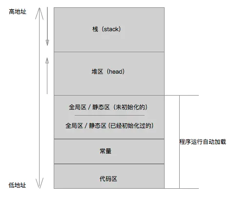

# App内存分区

App加载进内存时，系统会分将分配给应用程序的内存分成5个区域，分别是栈区（stack），堆区（heap），全局/静态区（.bss/.data），常量区（const）和代码区（text）。其中：

栈区：由系统管理和释放，存放一些局部变量，函数参数，函数的调用地址等等。栈区的地址空间是由低到高分配的连续空间，地址的分配和释放遵循FILO原则，类似于数据结构中的栈。

全局/静态区：存放全局和静态变量，程序退出时，统一由系统释放。
常量区：存放字符串常量，程序退出时，统一由系统释放。

代码区：顾名思义，存放程序的二进制代码，程序退出时，统一由系统释放。

整个分区如下图：



可以通过下面的代码更深一步了解内存的分区：

```
int a = 0;  //a变量地址在全局初始化区（因为a是int型，所以地址里存放的就是5）
NSString *s1;  //s1变量的地址在全局未初始化区
NSString *s2 = @"123"; //s2变量的地址在全局初始化区，但是字符串“123”存放在常量区

int main(int argc, const char * argv[]) {
    @autoreleasepool {
        // insert code here...

        int b; //b变量地址在栈区
        NSString *s3 = @"1234"; //s3变量地址在栈区，字符串“1234”在常量区
        static int c = 0;  //c变量地址在全局/静态初始化区

        id objc = [[NSObject alloc] init];  
        //objc变量地址在栈区，地址里面所指向的内存在堆区
}
//注意⚠️：内存地址最小单位为字节，比如：0x0001-0x0002，相隔一个字节。
```
