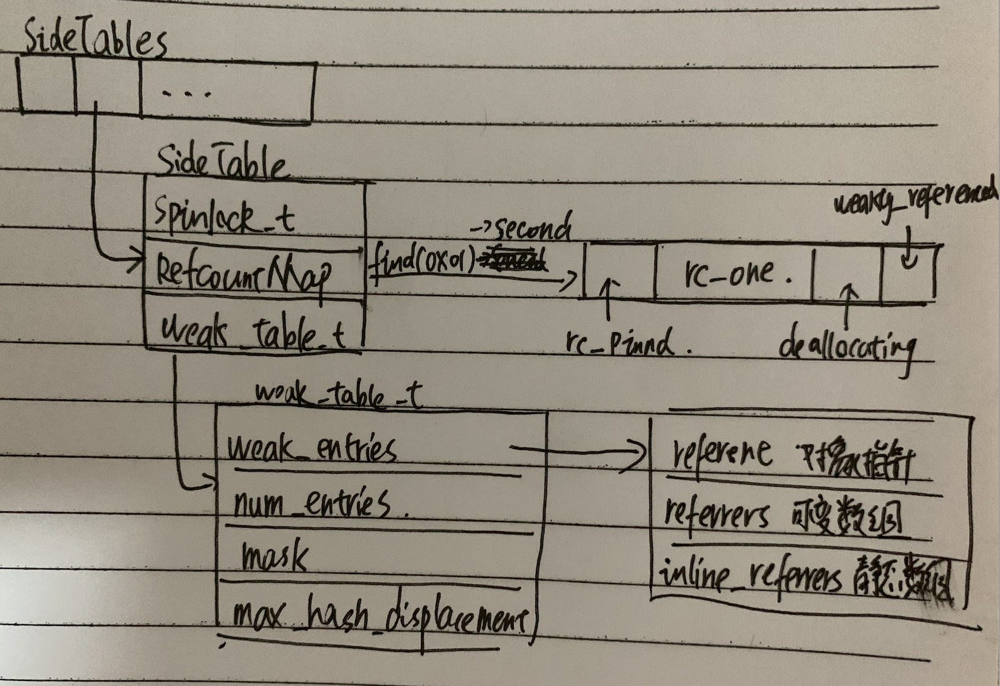

# SideTable

sideTables是一个哈希数组，里面存放的是sideTable。sideTable是一个结构体，包含一个自旋锁，引用计数表和弱引用表。（只有当对象的指针不是 NSTaggedPointer，没有开启NONPoniter_ISA优化或者开始NONPoniter_ISA但是对象的引用计数超过NONPoniter_ISA所能表示的范围时才会把对象的引用计数存在全局的sideTables。）sideTables整体的结构如下：



以上SideTable，Weak_table_t，weak_enterty_t的结构都可以在objc源码里找到，至RefcountMap通过find()函数查找对象的引用计数返回的结构，objc源码里没有直接给出来，但是返回值取指时做了位移操作，可以直接点那个宏进去，就可以看到定义的大概结构了。

```objectivec
namespace {

#if TARGET_OS_IPHONE && !TARGET_OS_SIMULATOR
uint32_t numFaults = 0;
#endif

// The order of these bits is important.
// 这个是强引用表储存对象相关位表示的信息
#define SIDE_TABLE_WEAKLY_REFERENCED (1UL<<0)
#define SIDE_TABLE_DEALLOCATING      (1UL<<1)  // MSB-ward of weak bit
#define SIDE_TABLE_RC_ONE            (1UL<<2)  // MSB-ward of deallocating bit
#define SIDE_TABLE_RC_PINNED         (1UL<<(WORD_BITS-1))

#define SIDE_TABLE_RC_SHIFT 2
#define SIDE_TABLE_FLAG_MASK (SIDE_TABLE_RC_ONE-1)

struct RefcountMapValuePurgeable {
    static inline bool isPurgeable(size_t x) {
        return x == 0;
    }
};

// RefcountMap disguises its pointers because we 
// don't want the table to act as a root for `leaks`.
typedef objc::DenseMap<DisguisedPtr<objc_object>,size_t,RefcountMapValuePurgeable> RefcountMap;

// Template parameters.
enum HaveOld { DontHaveOld = false, DoHaveOld = true };
enum HaveNew { DontHaveNew = false, DoHaveNew = true };

struct SideTable {
    spinlock_t slock; //自旋锁
    RefcountMap refcnts; //强引用计数表
    weak_table_t weak_table; //弱引用计数表

    SideTable() {
        memset(&weak_table, 0, sizeof(weak_table));
    }

    ~SideTable() {
        _objc_fatal("Do not delete SideTable.");
    }

    void lock() { slock.lock(); }
    void unlock() { slock.unlock(); }
    void forceReset() { slock.forceReset(); }

    // Address-ordered lock discipline for a pair of side tables.

    template<HaveOld, HaveNew>
    static void lockTwo(SideTable *lock1, SideTable *lock2);
    template<HaveOld, HaveNew>
    static void unlockTwo(SideTable *lock1, SideTable *lock2);
};


template<>
void SideTable::lockTwo<DoHaveOld, DoHaveNew>
    (SideTable *lock1, SideTable *lock2)
{
    spinlock_t::lockTwo(&lock1->slock, &lock2->slock);
}

template<>
void SideTable::lockTwo<DoHaveOld, DontHaveNew>
    (SideTable *lock1, SideTable *)
{
    lock1->lock();
}

template<>
void SideTable::lockTwo<DontHaveOld, DoHaveNew>
    (SideTable *, SideTable *lock2)
{
    lock2->lock();
}

template<>
void SideTable::unlockTwo<DoHaveOld, DoHaveNew>
    (SideTable *lock1, SideTable *lock2)
{
    spinlock_t::unlockTwo(&lock1->slock, &lock2->slock);
}

template<>
void SideTable::unlockTwo<DoHaveOld, DontHaveNew>
    (SideTable *lock1, SideTable *)
{
    lock1->unlock();
}

template<>
void SideTable::unlockTwo<DontHaveOld, DoHaveNew>
    (SideTable *, SideTable *lock2)
{
    lock2->unlock();
}

static objc::ExplicitInit<StripedMap<SideTable>> SideTablesMap;

static StripedMap<SideTable>& SideTables() {
    return SideTablesMap.get();
}

// anonymous namespace
};
```

#### 通过retainCount方法来分析SideTable结构

调用retaincount最终会走到rootRetainCount：

```objectivec
inline uintptr_t 
objc_object::rootRetainCount()
{
    if (isTaggedPointer()) return (uintptr_t)this; //如果是TaggedPointer直接返回

    sidetable_lock();
    isa_t bits = __c11_atomic_load((_Atomic uintptr_t *)&isa.bits, __ATOMIC_RELAXED); //原子化操作，获取isa,bits，类似于上锁
    if (bits.nonpointe) {
        uintptr_t rc = bits.extra_rc; //bits.extra_rc是真正的引用计数
        if (bits.has_sidetable_rc) {  //如果引用计数溢出，则需要加上SideTable上面的值
            rc += sidetable_getExtraRC_nolock(); //获取SideTable上面的rc
        }
        sidetable_unlock();
        return rc;
    }

    sidetable_unlock();
    return sidetable_retainCount();  //不是TaggedPointer，不是nonpointer，直接获取SideTable上面的rc
}

size_t 
objc_object::sidetable_getExtraRC_nolock()
{
    ASSERT(isa.nonpointer);
    SideTable& table = SideTables()[this];
    RefcountMap::iterator it = table.refcnts.find(this);
    if (it == table.refcnts.end()) return 0;
    else return it->second >> SIDE_TABLE_RC_SHIFT; //通过移位获取rc
}

uintptr_t
objc_object::sidetable_retainCount()
{
    SideTable& table = SideTables()[this];

    size_t refcnt_result = 1; //+1返回

    table.lock();
    RefcountMap::iterator it = table.refcnts.find(this);
    if (it != table.refcnts.end()) {
        // this is valid for SIDE_TABLE_RC_PINNED too
        refcnt_result += it->second >> SIDE_TABLE_RC_SHIFT;
    }
    table.unlock();
    return refcnt_result;
}
```

1.判断指针是否是TaggedPointer，如果是，则直接返回，因为TaggedPointer不需要管理引用计数，如果不是，则往下走。

2.判断该指针是否是nonpointer，如果是，则先获取extra_rc的值（注意这里没有+1），再判断是否有溢出，没有则直接返回；如果有，则以对象的内存地址为key，获得对应的SideTable，然后再调用RefcountMap的find方法得到rc_one，最后加上extra_rc的值返回；如果不是nonpointer，往下走。

3.直接调用sideTable_retainCount方法，获取对应的引用计数返回（注意这里+1返回）。

---

### 参考：

[iOS管理对象内存的数据结构以及操作算法](https://www.jianshu.com/p/ef6d9bf8fe59)
